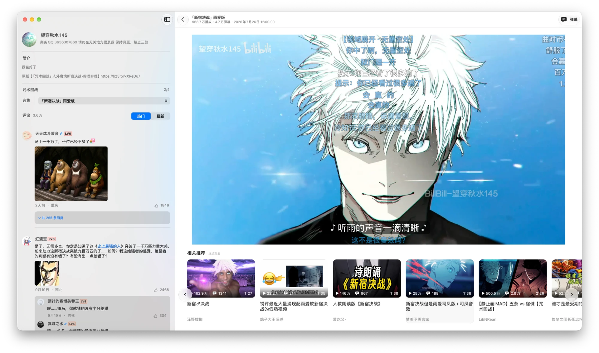

<p align="center">
  
  &nbsp;&nbsp;
  
</p>

<h1 align="center">BiliKit</h1>

<p align="center"><strong>在 Mac 上，好好看 B 站。</strong></p>

<p align="center">第三方开源 B 站客户端，用 Mac 原生技术写成</p>

<p align="center">
  
  
  
  <a href="https://github.com/shiinayane/BiliKit-Mac/releases/latest"></a>
  <a href="LICENSE"></a>
</p>

<p align="center">
  <a href="https://github.com/shiinayane/BiliKit-Mac/releases/latest"><strong>下载 BiliKit</strong></a>
</p>

<p align="center">
  
</p>

## 为什么用 BiliKit

|  | 网页版 / 官方 Mac 客户端 | BiliKit |
| --- | --- | --- |
| 技术栈 | 官方客户端基于 Electron，本质是网页 | SwiftUI 构建界面，视频网格、评论、弹幕这些对性能敏感的地方用 AppKit，播放交给 AVPlayer |
| 安装包 | 官方客户端近 200 MB | 不到 10 MB |
| 运行内存 | 官方客户端常常上 GB | 百兆级 |
| 推荐流 | 夹着推广、直播和各种弹窗 | 只有视频，推广卡片和非视频条目被过滤 |
| 看完一个视频 | 新标签页越开越多，回不到刚才的列表 | 同一个窗口里返回，列表停在原来的位置 |
| 播放器 | 网页播放器 | 系统播放器：画中画、全屏、媒体键、控制中心 |
| 不登录时 | 清晰度受限 | 可以选 720P 和 1080P |
| 账号 | 容易误点关注、投币 | 只读，唯一会写入的是观看进度 |

<sub>官方客户端的技术栈与安装包大小取自其官方下载地址（`pc_electron_mac/bili_mac.dmg`，2026 年 9 月）。</sub>

## 能做什么

- **浏览**：首页推荐、热门、搜索和观看历史，每个入口记得自己的滚动位置。
- **播放**：自动画质、倍速、画中画、全屏，系统字幕菜单，Now Playing 和媒体键。
- **弹幕**：和画面走同一条时间轴，拖动、暂停、倍速都不会错位；速度、显示区域、密度和透明度可以调。
- **视频页**：分 P、简介、只读评论（楼中楼、图片）和相关推荐，都在播放器旁边。
- **登录**：用 B 站 App 扫码登录，观看进度会同步到你的 B 站观看历史。
- **更新**：安装包经 Apple 签名和公证，新版本在应用内提示。

<p align="center">
  
</p>

## 快捷键

| 按键 | 作用 |
| --- | --- |
| 空格 | 播放 / 暂停 |
| ← / → | 后退 / 前进 5 秒 |
| 按住 ← / → | 临时 0.5 倍 / 2 倍速，松开恢复 |
| ↑ / ↓ | 音量 |
| D | 弹幕开关 |
| C | 字幕开关 |

## 接下来

- **新的视频页**：视频固定在上方，往下看简介和推荐时画面不会滚走。
- **UP 主空间**：从一个视频进到 UP 主的投稿、合集和系列，顺着一个人看下去。

详细计划见[路线图](docs/ROADMAP.md)。

## 安装

1. 下载[最新版 DMG](https://github.com/shiinayane/BiliKit-Mac/releases/latest)。
2. 把 BiliKit 拖进“应用程序”，打开即可。

需要 Apple Silicon Mac（M 系列芯片）和 macOS 15 或更高版本。Intel Mac 请使用
[1.0.0](https://github.com/shiinayane/BiliKit-Mac/releases/tag/v1.0.0)，这是最后一个支持 Intel 的版本。
安装、卸载和更新的细节见[分发说明](DISTRIBUTION.md)。

## 常见问题

<details>
<summary>这是官方客户端吗？</summary>

不是。BiliKit 是第三方开源项目，和哔哩哔哩没有隶属、认可或赞助关系。
</details>

<details>
<summary>登录安全吗？</summary>

登录用 B 站官方的二维码。登录信息只保存在这台 Mac 的钥匙串里，不同步到 iCloud。
BiliKit 没有自己的服务器，也没有统计或广告 SDK，不会替你点赞、投币或关注。详见[隐私说明](PRIVACY.md)。
</details>

<details>
<summary>会支持下载、直播或多账号吗？</summary>

不会。这些都不在计划里，BiliKit 只想把看视频这件事做好。
</details>

<details>
<summary>从源码构建</summary>

用 Xcode 打开 `BiliKitMac.xcodeproj`，选择 `BiliKitMac` scheme 和 “My Mac” 运行。完整检查：

```sh
sh Scripts/run-quality-gates.sh app
```

[架构](docs/ARCHITECTURE.md) · [安全模型](docs/SECURITY-MODEL.md) · [发布流程](docs/release/README.md) ·
[安全问题报告](SECURITY.md) · [App Icon 源文件](Design/AppIcon/v1/) · [宣传截图](Design/Marketing/v1/)
</details>

## 许可证与声明

源代码使用 [MIT License](LICENSE)。BiliKit 名称、图标和宣传素材不在 MIT 授权范围内，见
[品牌资产权利声明](BRAND-ASSETS.md)；第三方依赖见 [THIRD_PARTY_NOTICES.md](THIRD_PARTY_NOTICES.md)。
哔哩哔哩相关名称与商标归其权利人所有。
